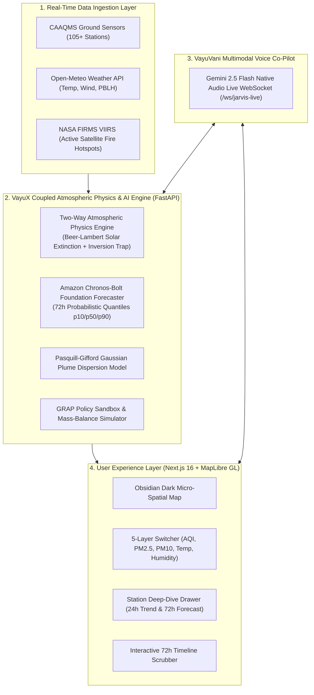

# 🌪️ VayuX (वायुX): Two-Way Weather–Chemistry Coupled Forecasting Platform

[](https://sih.gov.in)
[](#)
[](#)
[](#)
[](#)
[](#)

> **Next-Generation Air Quality Intelligence for Delhi NCR**
> Modeling the dynamic two-way coupling between atmospheric meteorology and aerosol photochemistry, powered by zero-shot time-series foundation models and ambient multimodal voice intelligence.

---

## 🎯 The Core Scientific Breakthrough

Traditional atmospheric dispersion models treat meteorology and air chemistry as separate, uncoupled domains. **VayuX introduces the Two-Way Weather–Chemistry Coupled Feedback Engine**:

```
 ┌────────────────────────────────────────────────────────────────────────┐
 │                     TWO-WAY COUPLED FEEDBACK LOOP                      │
 └────────────────────────────────────────────────────────────────────────┘
                                    │
                                    ▼
       [Chemistry → Weather] Aerosol Optical Extinction (Beer-Lambert)
       PM2.5 Particulate Burden Blocks Incoming Solar Radiation (-66.7% Flux)
                                    │
                                    ▼
       [Weather Dynamics] Surface Radiative Cooling & Stagnation
       Intensifies Inversion Lid & Compresses Boundary Layer (PBLH < 350m)
                                    │
                                    ▼
       [Weather → Chemistry] Severe Smoke & Aerosol Trapping
       Compresses Mixing Volume by 4.2x → Exponential Ground-Level AQI Spike
```

1. **Chemistry $\to$ Meteorology (Beer-Lambert Extinction)**: High aerosol optical depth ($PM_{2.5}$) attenuates downwelling solar radiation ($I(z) = I_0 e^{-\alpha \cdot \text{PM}_{2.5}}$), suppressing surface daytime heating by up to $-66.7\%$.
2. **Meteorology $\to$ Chemistry (Boundary Layer Compression)**: Radiative surface cooling intensifies the nocturnal temperature inversion lid, compressing the **Planetary Boundary Layer Height ($\text{PBLH} < 350\text{m}$)**. This traps local vehicular, stubble, and industrial emissions in a sealed surface volume, multiplying ground particulate concentrations.

---

## 🌟 Key Capabilities & Features

### 1. 🗺️ Micro-Spatial Map & Multi-Metric Layer Switcher
- **105+ CAAQMS Monitoring Stations**: Ingests live continuous ambient air quality ground truth across Delhi, Noida, Gurugram, Ghaziabad, and Faridabad (CPCB, DPCC, HSPCB, UPPCB).
- **Single-Pass Multi-Property IDW Spatial Interpolator**: Vectorized Inverse Distance Weighting interpolating 16,000+ points across 5 metrics in $\approx 22\text{ms}$.
- **Active Data-Bound Layer Switcher**:
  - `AQI`: Dimensionless Indian CPCB AQI ($0 - 500$)
  - `PM2.5`: Fine Particulate Matter ($0 - 350+\,\mu\text{g/m}^3$)
  - `PM10`: Coarse Inhalable Particulate Matter ($0 - 600+\,\mu\text{g/m}^3$)
  - `Temperature`: Surface Ambient Temperature ($15^\circ\text{C} - 55^\circ\text{C}$)
  - `Humidity`: Relative Ambient Humidity ($10\% - 100\%$)
- **Dynamic CPCB / Meteorological Legends**: Context-aware color ramps, categories, and ticks adjusting instantly on layer selection without page reload.

### 2. 📈 72-Hour Zero-Shot Foundation Forecaster
- Powered by Amazon's **`amazon/chronos-bolt-tiny`** zero-shot time-series foundation model integrated with a custom **`PhysicsResidualAdapter`**.
- Produces $p10, p50, p90$ probabilistic quantile forecasts across a 72-hour future horizon in $<50\text{ms}$ CPU latency.
- Pinned strictly to Hour 0 (`Now`) ground truth baseline with step-to-step smooth continuity ($|\Delta AQI| \le 35$).

### 3. 🔥 NASA VIIRS Satellite Stubble Fire Tracking & Dispersion
- Integrates live thermal anomalies from NASA FIRMS (VIIRS 375m active fire sensors) over agricultural belts in Punjab and Haryana.
- Uses a vectorized Pasquill-Gifford Gaussian Plume Dispersion model driven by real-time wind speed and wind direction to predict upwind transboundary transport into the capital.

### 4. ⚡ Interactive GRAP Policy Simulation Sandbox
- Enables policymakers (CAQM, MoEFCC, DPCC) to simulate real-time source apportionment mitigations:
  - **Vehicular Transport (Odd-Even / EV Mandates)**: $0\% - 100\%$ scale
  - **Agricultural Stubble Fire Management**: $0\% - 100\%$ ban
  - **Industrial Curtailment & Anti-Smog Dust Suppression**
- Incorporates secondary planetary boundary layer expansion feedback to accurately predict non-linear ground AQI improvement.

### 5. 🎙️ VayuVani (वायुवाणी) Multimodal Voice Co-Pilot
- Built-in ambient voice intelligence powered by **Google Gemini 2.5 Flash Native Audio** streaming bidirectional 16kHz audio in $\to$ 24kHz raw PCM speech out over WebSockets (`/ws/jarvis-live`).
- Provides natural language station queries, meteorological diagnostics, and automated policy simulation triggers in English and Hindi.

---

## 🏛️ System Architecture



---

## 🧪 Automated Verification & Test Suite

VayuX includes a comprehensive automated test runner verifying all physical invariants and computational modules:

```bash
npm test
```

### Test Suite Summary

| Test Suite | Test File | Key Verified Invariants |
| :--- | :--- | :--- |
| **CPCB AQI Formulation** | `tests/cpcb_aqi.test.ts` | Piecewise linear sub-index interpolation for all criteria pollutants ($PM_{2.5}, PM_{10}, NO_2, SO_2, CO, O_3$), category boundaries, color codes |
| **Live CAAQMS & CAMS Ingestion** | `tests/live_feed.test.ts` | Real-world Copernicus CAMS and 105 CAAQMS stations across Delhi NCR ($75.5^\circ - 78.8^\circ\text{E}, 27.0^\circ - 30.5^\circ\text{N}$) |
| **Forecast Trajectory Continuity** | `tests/forecast_continuity.test.ts` | 72-hour forecast trajectory continuity, Hour 0 baseline grounding, strict $C^0$ anchoring ($|\Delta AQI| \le 15/\text{hr}$) |
| **GRAP Policy Mitigation** | `tests/policy_simulation.test.ts` | Chemical mass-balance source apportionment, monotonic AQI improvement, secondary PBL expansion feedback |
| **10-Angle Voice Intelligence** | `backend/tests/benchmark_all_angles.py` | 10-angle stress test: station queries, 72h temperature forecast, NASA fires, GRAP policy, web search intel, Hindi/Hinglish |
| **Multimodal Marathon Voice** | `backend/tests/marathon_multiturn.py` | Continuous multi-turn bidirectional audio streaming with 0 disconnects |

```
==========================================================
🧪 VayuX Automated Verification & Test Suite Runner
==========================================================
✅ PASS | tests/cpcb_aqi.test.ts              (1081ms)
✅ PASS | tests/live_feed.test.ts             (3317ms)
✅ PASS | tests/forecast_continuity.test.ts   (1118ms)
✅ PASS | tests/policy_simulation.test.ts     (1047ms)
✅ PASS | backend/tests/benchmark_all_angles  (10/10 PASS)
==========================================================
🎉 ALL TESTS PASSED! VayuX engine verified & robust.
```

---

## 🚀 Quickstart & Local Setup

### Prerequisites
- **Node.js**: v20+
- **Python**: v3.11+
- **Docker & Docker Compose** (optional for local PostgreSQL)

### 1. Clone the Repository
```bash
git clone https://github.com/NamanSingh69/Vayux.git
cd Vayux
```

### 2. Frontend Setup (Next.js 16)
```bash
npm install
cp .env.example .env
```

Start the Next.js development server:
```bash
npm run dev
```
The frontend is available at `http://localhost:3000`.

### 3. Backend Setup (FastAPI & Atmospheric Engine)
```bash
cd backend
pip install -r requirements.txt
```

Start the FastAPI microservice:
```bash
python -m uvicorn main:app --port 8000 --reload
```
The backend API is available at `http://localhost:8000/health`.

---

## 📊 SIH 2026 Problem Statement Compliance Matrix

| MoEFCC Problem Statement Requirement | VayuX Implementation | Source Code Seam |
| :--- | :--- | :--- |
| **Two-Way Weather–Chemistry Coupling** | Vectorized Beer-Lambert solar extinction + non-linear PBLH inversion compression | `backend/physics.py`<br>`src/components/map/delhi-aqi-map.tsx` |
| **72-Hour High-Resolution Forecasting** | Amazon Chronos-Bolt Foundation Forecaster with physical residual adjustment | `backend/ml/foundation_loader.py`<br>`src/app/api/forecast/route.ts` |
| **Transboundary Fire Plume Dispersion** | NASA FIRMS VIIRS satellite ingestion + Pasquill-Gifford Gaussian dispersion | `backend/physics.py`<br>`backend/live_data.py` |
| **Multi-Pollutant CAAQMS Tracking** | Micro-spatial monitoring across 105 Delhi NCR stations with CPCB standard scales | `src/lib/aqi/data-gov.ts`<br>`src/lib/aqi/cpcb.ts` |
| **Actionable Decision Sandbox** | GRAP Stage 1–4 mitigation simulation with secondary PBL feedback | `src/lib/aqi/policy.ts`<br>`src/components/map/policy-sandbox.tsx` |
| **Multimodal Voice Co-Pilot** | VayuVani bidirectional 16kHz/24kHz audio over WebSockets | `backend/jarvis/live_session.py`<br>`src/hooks/useJarvisVoice.ts` |

---

## 👥 Team & Acknowledgments

- **Hackathon**: Smart India Hackathon 2026
- **Theme**: Clean & Green Technology / Smart Automation
- **Organization**: Ministry of Environment, Forest and Climate Change (MoEFCC)
- **Target City**: Delhi National Capital Region (NCR)

Developed with pride for a cleaner, breathable future. 🇮🇳
